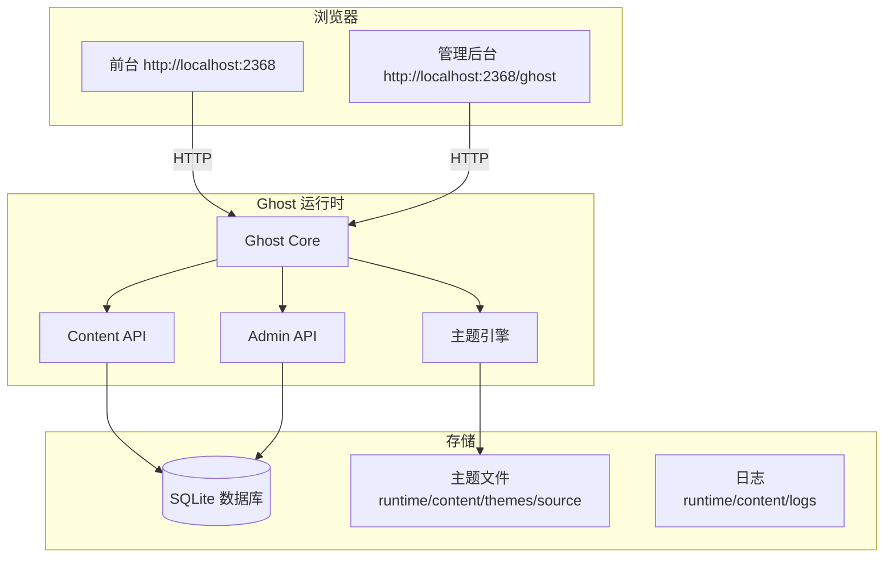

# Oss-Blog

基于 **Ghost 6.62.0** 开源博客系统二次开发的个人博客项目。

## 技术栈

- **Ghost** 6.62.0
- **Node.js** 22.23.2
- **SQLite**（开发环境）
- **Ghost CLI** 1.32.3
- **Handlebars**（主题模板引擎）

## 项目架构



## 环境要求

| 工具 | 最低版本 | 检查命令 |
|------|---------|---------|
| Node.js | 22 LTS | `node --version` |
| npm | 10.x | `npm --version` |
| Git | 2.40+ | `git --version` |

## 安装与运行

### 1. 克隆项目

```bash
git clone https://github.com/52kai/oss-blog.git
cd oss-blog
```

### 2. 启动 Ghost

```bash
cd runtime
ghost start
```

### 3. 访问地址

| 页面 | 地址 |
|------|------|
| 博客前台 | http://localhost:2368 |
| 管理后台 | http://localhost:2368/ghost |

### 4. 停止服务

```bash
cd runtime
ghost stop
```

### 5. 重启服务

```bash
cd runtime
ghost restart
```

## 项目结构

```
oss-blog/
├── docs/                        # 项目文档
│   ├── architecture.md          # 架构说明
│   ├── baseline.md              # 基线信息
│   └── ghost-export-*.json     # 数据备份
├── theme/
│   └── oss-blog-theme/          # 自定义主题源码
│       ├── assets/              # 样式与资源文件
│       ├── partials/            # 模板片段
│       ├── post.hbs             # 文章详情页
│       ├── error.hbs            # 404 错误页
│       └── default.hbs          # 主布局
├── tests/
│   └── acceptance.md            # 验收测试报告
├── runtime/                     # Ghost 运行实例（.gitignore 排除）
├── .gitignore
├── NOTICE.md                    # 第三方许可证
└── README.md
```

## 二次开发内容

### 1. 自定义主题（3 处修改）

| 修改项 | 文件 | 说明 |
|--------|------|------|
| 阅读时长 | `partials/post-card.hbs` | 文章列表卡片底部显示阅读时间 |
| 标签徽章 | `post.hbs` | 文章详情页标题下方显示标签名 |
| 导航栏样式 | 调整 CSS | 优化导航栏布局 |

### 2. 相关推荐功能

| 项目 | 说明 |
|------|------|
| 功能 | 文章详情页底部按相同标签推荐 3 篇文章 |
| 文件 | `post.hbs` |
| 实现 | 使用 Ghost `{{#get}}` 模板助手过滤同标签文章 |

### 3. 自定义 404 页面

| 项目 | 说明 |
|------|------|
| 功能 | 访问已删除或不存在的文章时显示 404 页面 |
| 文件 | `error.hbs` |
| 效果 | 显示 404 状态码 + 错误信息 + "返回首页"按钮 |

### 4. 搜索功能

| 项目 | 说明 |
|------|------|
| 功能 | 支持中文关键词搜索 |
| 文件 | 主题内置 Ghost Search |
| 效果 | 点击搜索图标，输入关键词即可搜索文章 |

## 演示账号

| 角色 | 账号 | 说明 |
|------|------|------|
| 管理员 | 创建时设置的邮箱/密码 | 拥有全部管理权限 |
| 会员 | 在后台 Members 中创建 | 仅可评论，不可写文章 |

## 测试

测试用例详见 `tests/acceptance.md`，包含：

- 功能测试 8 条（发布、编辑、删除、标签、搜索、评论、相关推荐）
- 权限测试 4 条（管理员、会员、匿名、未登录）
- 主题测试 4 条（桌面、响应式、键盘导航、主题元素）
- 恢复测试 2 条（重启持久化、导出恢复）

## 已知问题

1. 本地开发无邮件服务，会员登录需使用 MailDev 或通过 Staff 设置密码
2. 搜索功能依赖 Ghost 内置搜索，不支持自定义排序
3. SQLite 数据库不适合生产环境，建议切换 MySQL

## 上游项目

- [TryGhost/Ghost](https://github.com/TryGhost/Ghost) — MIT License
- 固定版本：6.62.0
- 许可证信息详见 `NOTICE.md`

## 许可证

本项目基于 Ghost 进行二次开发，遵循上游 MIT 许可证。